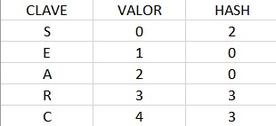

<div align="right">

</div>

# TDA HASH

## Repositorio de John O'Connor - 110102 - johnoc1712@gmail.com

- Para compilar:

```bash
Línea de compilación pruebas cátedra: gcc -std=c99 -Wall -Wconversion -Wtype-limits -pedantic -Werror -O2 -g src/*.c pruebas_chanutron.o -o pruebas_chanutron
Línea de compilación pruebas alumno: gcc -std=c99 -Wall -Wconversion -Wtype-limits -pedantic -Werror -O2 -g src/*.c pruebas_alumno.c -o pruebas_alumno
```

- Para ejecutar:

```bash
Línea de ejecución pruebas catedra: ./pruebas_chanutron
Línea de ejecución pruebas alumno: ./pruebas_alumno
```

- Para ejecutar con valgrind:
```bash
Línea de ejecución con valgrind pruebas cátedra: valgrind --leak-check=full --track-origins=yes --show-reachable=yes --error-exitcode=2 --show-leak-kinds=all --trace-children=yes ./pruebas_chanutron
Línea de ejecución con valgrind pruebas alumno: valgrind --leak-check=full --track-origins=yes --show-reachable=yes --error-exitcode=2 --show-leak-kinds=all --trace-children=yes ./pruebas_alumno
```
---
##  Funcionamiento

Las estructuras desarrolladas en el TP implementan una **TABLA DE HASH ABIERTA**, con direccionamiento cerrado, en lenguaje C.

En primer lugar se crea un hash mediante la función `hash_crear`, cuyo proceso se ve representado en el siguiente diagrama:


A partir del hash creado, se pueden realizar distintas operaciones, siendo algunas de ellas de naturaleza iterativa y otras de naturaleza recursiva. Las operaciones disponibles para realizar son: crear un hash (`hash_crear`), insertar pares de <clave,valor> (`hash_insertar`), quitar pares de <clave,valor> (`hash_quitar`), obtener el elemento correspondiente a una clave dada (`hash_obtener`), verificar si el hash contiene una clave dada (`hash_contiene`), obtener la cantidad de pares que tiene el hash (`hash_cantidad`), destruir el hash (`hash_destruir`), destruir el hash a medida que se aplica una función destructora a cada elemento del hash (`hash_destruir_todo`) y por último se dispone de un iterador interno para iterar el hash y aplicar una función dada a cada uno de los elementos del mismo (`hash_con_cada_elemento`).

A la hora de insertar un elemento en el hash, se utiliza la función `nodo_crear`, cuyo proceso de utilización de memoria se ve representado en el siguiente esquema:


El elemento copia, se realiza debido a que al crear el nodo, es necesario inicializar la clave del mismo con una copia de la clave a la cual apunta el puntero dado por parámetro. Esto es así ya que cabe la posibilidad de que luego de insertar una clave, esta sea modificada por fuera del heap, y que por lo tanto, si se quiere buscar la clave inicial ya no se encontraría en el mismo, porque fue modificada. Esto se soluciona guardando en el nodo una copia de la clave en vez de utilizar el mismo puntero.

A la hora de insertar elementos en el hash, se tiene en cuenta un direccionamiento de colisiones cerrado. Esto quiere decir que las colisiones se manejan encadenando los elementos, en este caso en listas de nodos simplemente enlazados. Cabe recalcar que en el caso en que una clave ya exista dentro del hash, y se inserte otro elemento con la misma clave, esto no se considera una colisión, sino que se actualiza el valor del elemento.

Como mencioné, en términos generales la implementación del hash fue de naturaleza iterativa. Sin embargo hubo algunos casos en los que el plenteo del problema dio lugar a una resolución con naturaleza recursiva. Estos casos son: para obtener y buscar valores, y para destruir y liberar la memoria de los nodos al destruir el hash. En todos estos casos se planteó un desarrollo recursivo debido a que, al tener que recorrer todos los nodos de cada lista enlazada, sin tener la cantidad de nodos en cada una de las listas, la condición de corte sería cuando un nodo es *NULL*, siendo este caso el que no hay más nodos en la lista, y además, debido a que los pasos a seguir eran repetitivos en cada iteración.

Por último, la función `hash_con_cada_elemento` es un iterador interno que posibilita recorrer el hash, a medida que se le aplica una función dada a cada elemento del mismo.

## Respuestas a las preguntas teóricas

   - Qué es un diccionario

   Un diccionario es una estructura de datos que permite almacenar y organizar información de manera tal que el acceso a la misma sea eficiente. El tipo de elementos que almacena un diccionario son pares de <clave,valor> (como se muestra en la siguiente figura), donde cada clave es necesariamente única, porque se utilizan para establecer y acceder a los valores asignados a cada una de ellas, los cuales se pueden repetir y hasta ser nulos.


   - Qué es una función de hash y qué características debe tener.

   Una función de hash es un algoritmo que dado un par <clave,valor> que se desea almacenar, genere una cadena conocida como 'valor de hash' a partir de una clave asociada al mismo. Dicho valor de hash es en definitiva único para cada clave a partir de la cuál se generó, es decir que una misma clave a almacenar, siempre tendrá el mismo valor de hash. La asignación de valores de hash para cada par se puede observar en la siguiente figura.



   Dentro de las características que debe cumplir una función se hash se encuentran:

   Unidireccionalidad: Cuando una función de hash recibe una clave, devuelve el valor de hash correspondiente a la misma. La unidireccionalidad de esta función hace referencia a que, a partir del valor de hash de una clave, sea muy difícil y hasta imposible obtener la clave original.

   Carácter único de valor de hash: Como mencioné anteriormente, dado una clave, el valor de hash producido por la función de hash a partir de esta debe ser siempre el mismo. Esto permite posteriormente acceder a los elementos correctamente.

   Sensibilidad a cambios: Esta característica refiere a que a la mínima diferencia en la clave de entrada de la función, el valor de hash adjudicado a dicha clave debe ser, en general, completamente diferente. 


   - Qué es una tabla de Hash y los diferentes métodos de resolución de colisiones vistos (encadenamiento, probing, zona de desborde)

   Una tabla de hash es una estructura de datos utilizada para almacenar y acceder a información de manera eficiente. Su funcionamiento se basa en una función de hash, que se utiliza para convertir un valor en una ubicación o índice dentro de una tabla.

   La tabla de hash consta en principio de una tabla, un vector, donde cada uno de sus índices representan una posición posible a la que pueden dirigirse los pares a almacenar en el hash. Como se vio en las figuras anteriores, dadas claves distintas, puede ocurrir que el valor de hash para algunas de ellas sea el mismo. Esta situación se conoce como una colisión de valores de hash y la forma en la que resuelve depende del tipo de implementación que se esté realizando.

   En primer lugar, un hash con manejo de colisiones por encadenamiento, a la hora de encarar una colisión, justamanete encadena el par colisionado luego del par que se encontraba en dicho índice de la tabla. Poniendo un ejempo, se tiene el par <E,1>, cuyo valor de hash es 0. Se inserta dicho par en el hash como se muestra en la figura. Luego, se tiene el par <A,2>, cuyo valor de hash también es 0. A la hora de insertarlo en el hash, cuando va a la posición 0 en la tabla de hash y se encuentra con que ya hay un elemento en esa posición, se establece este nuevo par como el siguiente al par anterior, pero por fuera de la tabla de hash, armando una lista de nodos enlazados. Este ejemplo y uno similar se observa en la siguiente figura.


   Luego, también se puede desarrollar un manejo de colisiones por 'probing'. Este tipo de implementación se basa en que, a la hora de producirse una colisión, se busca recorre la tabla de hash según un criterio dado hasta encontrar un espacio libre en la misma para insertar el elemento. El criterio dado puede ser lineal (insertar en el siguiente espacio inmediato), cuadrático (considera la cantidad de intentos fallidos al cuadrado para insertar), etc. 
   En el caso de probing lineal, un ejemplo de manejo de una colision se puede ver representado en la siguiente figura. Habiéndose ya insertado los pares <54,000>, <26,111>, <70,222>, <31,333> y <93,444>, se desea insertar el par <40,555>, cuyo valor de hash es 0, coincidente con el valor de hash del par <70,222>. Así, al ir a la posición 0 de la tabla de hash y notar que está ocupada, se dirige a la posición 1, la cual también está ocupada, por lo que se dirige a la posición 2, y como esta no está ocupada, se inserta el par. Este ejemplo se ve representado en la siguiente figura.


   Por último, otra opción de manejo de colisiones es la utilización de una zona de desborde. En este caso, al presentarse una colisión, en vez de encadenar el elemento en la misma dirección del hash, o aplicar probing lineal, lo que se hace es mandar todos los elementos colisionados a una tabla a parte, la cual va a ser la zona de desborde de la tabla de hash principal. Por ejemplo, si se inserta el par <E,1> con valor de hash 0, y el par <A,2> con valor de hash 0, el segundo par será insertado en una tabla a parte, a la cual apuntaría cada posición de la tabla de hash principal. Este ejemplo se puede ver representado en la siguiente figura.


